# Command Pattern

> 커맨드 패턴을 이용하면 요구 사항을 객체로 캡슐화 할 수 있으며, 매개변수를 써서 여러가지 다른 요구 사항을 집어넣을 수도 있다. 또한 요청 내역을 큐에 저장하거나 로그로 기록할 수도 있으며, 작업취소 기능도 지원.

 

## 구조

 

## 정리

- 커맨드 패턴을 이용하면 요청을 하는 객체와 그 요청을 수행하는 객체를 분리시킬 수 있다.
- 클라이언트는 인보커 버튼의 동작을 설정하고 단순히 그 해당 동작의 수행을 명령한다.
- 인보커에는 커맨드들이 정의되어있고 해당 동작 수행시 커맨드에게 동작을 넘긴다.
- 커맨드는 동작이 수행되는 객체(Receiver)를 가지고 있고 명령에 맞추어 해당 객체의 행동을 조정한다.

