# Iterator Pattern

> 컬렉션 구현 방법을 노출시키지 않으면서도 그 집합체 안에 들어있는 모든 항복에 접근할 수 있게 해주는 방법을 제공한다. 

## 구조

 

## 정리

- 이터레이터 패턴은 내부적인 구현 방법을 외부로 노출시키지 않으면서도 집합체에 있는 모든 항목에 일일이 접근할 수 있다.
- 컬렉션 객체 안에 들어있는 모든 항목에 접근하는 방식이 통일되어 있으면 어떤 종류의 집합체에 대해서도 사용할 수 있는 다형적인 코드를 만들 수 있다.
- 클라이언트의 printMenu() 메소드는 항목이 어느 구조를 사용하여 저장되어 있는지는 신경쓰지 않고 작업한다. 객체를 가져오는 순서는 iterator에게 의존하고 객체를 받아 출력만 담당한다.
- 모든 항목에 접근하는 방법을 iterator가 담당하므로 집합체의 인터페이스 및 구현이 간단해지며 집합체에서는 반복잡업에서 손을 떼고 원래 자신이 할 일에만 전념할 수 있다. 

## 디자인 원칙

- **단일 책임 원칙**(SRP, Single Responsibility Principle)
  - 클래스는 하나의 책임만을 가지며, 클래스를 바꾸는 이유는 한 가지 뿐이어야 한다.
  - 어떤 클래스가 담당하는 역할은 차후에 코드 변화를 불러올 가능성이 있다. 클래스가 담당하는 역할이 많아진다면 그만큼 코드 변화를 가져올 가능성이 높아진다.
- **응집도**
  - 한 클래스 또는 모듈이 특정 목적 또는 역할을 얼마나 일관되게 지원하는지를 나타내는 척도.
  - 어떤 모듈 또는 클래스의 응집도가 높다는 것은 일련의 서로 연관된 기능이 묶여있다는 것울, 응집도가 낮다는 것은 서로 상관 없는 기능들이 묶여있다는 것을 뜻한다.
  - SRP를 잘 만족하는 클래스는 두 개 이상의 역할을 가진 클래스에 비해 응집도가 높고, 관리하기도 용이하다.