# Template Method Pattern

> 템플릿 메소드 패턴에서는 템플릿 메소드에 알고리즘의 골격을 정의한다. 알고리즘의 여러 단계 중 일부는 서브클래스에서 구현할 수 있다. 템플릿 메소드를 이용하면 알고리즘의 구조는 그대로 유지하면서 서브클래스에서 특정 단계를 재정의할 수 있다. 

## 구조

- 템플릿 메소드 내부에 후크를 추가하여 구현 클래스의 유연성을 높일 수 있다.
- 후크는 기본적으로 아무일도 하지 않는 메소드로 구현 클래스가 이를 재정의해 필요에 맞게 활용할 수 있다.
- 클래스별로 동일한 작업은 추상 클래스에서 구현하고, 상이한 작업만 재정의 하여 사용한다.

 

## 디자인 원칙

- **헐리우드 원칙**
  - "Don't call us, we will call you."
  - 헐리우드 원칙을 활용하면 **의존성 부패**를 방지할 수 있다.
  - 어느 고수준 구성요소가 저수준 구성요소에 의존하고, 그 저수준 구성요소는 다시 고수준 구성요소와 그 밖의 다른 구성요소에 의존하는 것과 같이 의존성이 복잡하게 꼬여있는것을 의미한다.
  - 헐리우드 원칙을 사용하며나 언제 어떤 식으로 그 구성요소들을 사용할지는 고수준 구성요소에서 결정하게 된다. 

