# Abstract Factory Pattern

> 인터페이스를 이용하여 서로 연관된, 또는 의존하는 객체를 구상 클래스를 지정하지 않고도 생성할 수 있다.

 

## 구조

 

## 정리

- 인터페이스를 활용한 객체 구성(composition)을 통한 객체 생성
- AbstractFactory 인터페이스에 제품이 추가된다면 서브클래스를 모두 수정해야하는 단점이 있다
- 각각의 요소를 만들어야 하지만 팩토리 메소드와 달리 구현 객체를 모두 만들 필요는 없다.
- 사용하는 제품 군의 수정이 없다면 ConcreteFactory를 추가하는 것으로 확장 가능

