# Composite Pattern

> 객체들을 트리 구조로 구성하여 부분과 전체를 나타내는 계층 구조로 만들 수 있다. 이 패턴을 이용하면 클라이언트에서 개별 객체와 다른 객체들로 구성된 복합 객체를 똑같은 방법으로 다룰 수 있다. 

## 구조

- 복합 객체의 구성요소는 리프노드일 수도 있고 복합 객체일 수도 있다. 복합 객체 구성요소는 다시 구성요소로 잎과 복합 객체를 받을 수 있으며 전체 구조는 아래로 점점 뻗어져 나간다. 

## 정리

- 컴포지트 패턴은 클라이언트에서 개별 객체와 복합 객체를 같은 방법으로 다룰 수 있다. 즉 대부분의 경우에 복합 객체와 개별 객체를 구분할 필요가 없어진다.
- 컴포지트 패턴에서는 한 클래스가 두 가지 역할을 수행하며 SRP를 위반한다. 단일 역할 원칙을 깨는 대신 투명성을 확보하기 위한 패턴으로 볼 수 있다.
- 투명성: Component 인터페이스에 자식들을 관리하기 위한 기능과 잎으로써의 기능을 전부 집어넣음으로 클라이언트에서 복합 객체와 잎 노드를 똑같은 방식으로 처리할 수 있도록 할 수 있다. 어떤 원소가 복합 객체인지 잎 노드인지 클라이언트 입장에서는 투명하게 느껴진다.
- 대신 Component 클래스는 두 종류의 기능이 모두 들어있다 보니 안정성은 떨어진다. 클라이언트에서 어떤 원소에 대해 무의미한, 또는 부적절한 작업을 처리하려고 할 수도 있다(UnsupportedOperationException). 따라서 안정성과 투명성 사이의 결정이 필요하다.

