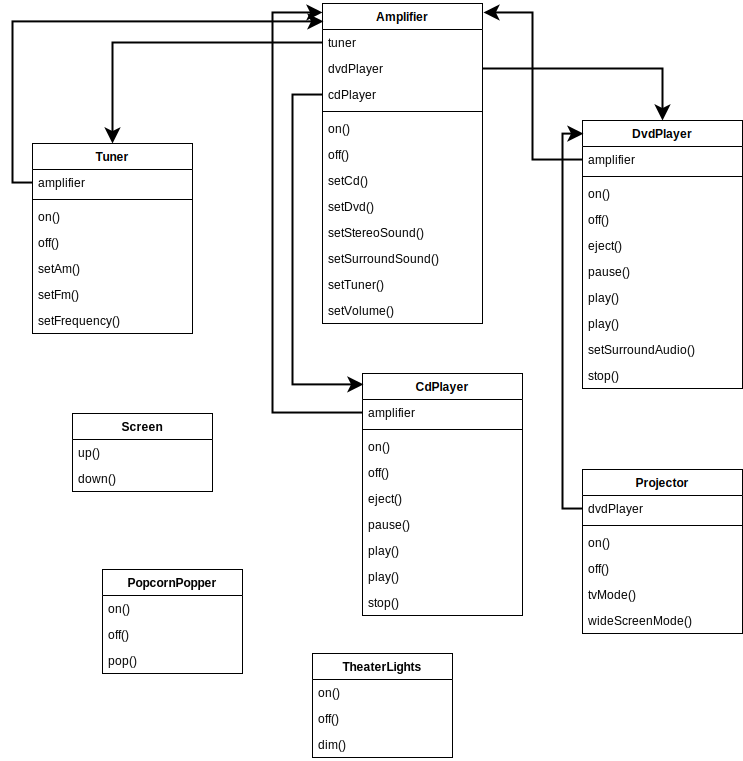
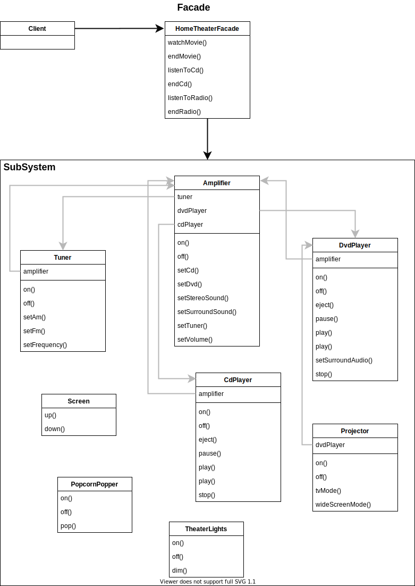

# Facade Pattern

> 어느 서브 시스템의 일련의 인터페이스에 대한 통합된 인터페이스를 제공한다. 퍼사드에서 고수준 인터페이스를 정의하기 때문에 서브 시스템을 더 쉽게 사용할 수 있다.

 

## 기존 구조

- 클라이언트가 서브시스템을 하나하나 조작해야 하고 참조하는 객체가 많아진다.

 

## Facade 구조

- 클라이언트는 복잡한 서브시스템을 퍼사드 클래스로 단순하게 접근 가능 하며 필요시 서브시스템도 조작할 수 있다. 

## 정리

- 큰 인터페이스, 또는 여러 인터네피스를 단순화시키거나 통합시켜야 되는 경우에는 퍼사드를 사용한다.
- 퍼사드는 인터페이스의 단순화 뿐만 아니라 클라이언트와 구성요소들로 이루어진 서브시스템을 분리시키는 역할도 한다.
- 퍼사드와 어댑터는 모두 여러 개의 클래스를 감쌀 수 있다. 하지만 퍼사드는 인터페이스를 단순화시키기 위한 용도로 사용되는 반면, 어댑터는 다른 인터페이스로 변환하기 위한 용도로 사용된다. 

## 디자인 원칙

- 최소 지식 원칙
  - 객체 사이의 상호작용은 가능한 가까운 객체들 사이에서만 허용하는것이 좋다.
  - 퍼사드 패턴은 클라이언트와 서브시스템을 분리하여 클라이언트와 결합된 클래스의 수를 낮춘다.
- 최소 지식 원칙의 가이드라인
  - 원칙을 만족하기 위해서 어느 메소드는 다음 객체들의 메소드만 호출한다.
    - 해당 객체 자체
    - 메소드에 매개변수로 전달된 객체
    - 해당 메소드에서 생성하거나 인스턴스를 만든 객체
    - 해당 객체에 속하는 객체
  - 어느 메소드 내에서 다른 메소드를 호출하여 반환받은 객체의 메소드를 호출하는것은 바람직하지 않다.
  - 객체들 사이의 의존성을 줄일 수 있지만, 다른 구성요소에 대한 메소드 호출을 처리하기 위해 "Wrapper" 클래스를 더 만들어야 할 수도 있기 때문에 시스템이 더 복잡해 지거나 개발 시간이 늘어나고 성능이 떨어질 수도 있다.